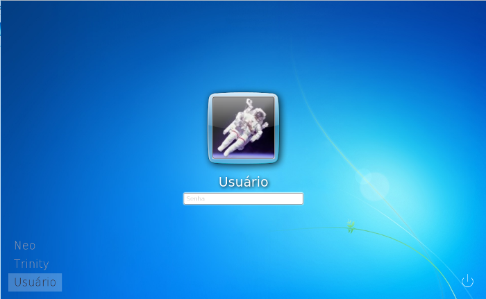

# Win7Mint for Webkit LightDM

This is a fork from project `Tendou for LightDM`. It is a greeter with style of Windows 7.



# How to install on Cinnamon

```bash
sudo su
apt update
apt install lightdm-webkit-greeter
cat << EOF > /etc/lightdm/lightdm.conf.d/70-linuxmint.conf
[SeatDefaults]
user-session=cinnamon
greeter-session=lightdm-webkit-greeter

EOF

# Do the download of this respository then move...
mv win7-mint-webkit-greeter /usr/share/lightdm-webkit/themes/
chmod 777 -R /usr/share/lightdm-webkit/themes/win7-mint-webkit-greeter/

lineTheme=$(grep "webkit-theme=" /etc/lightdm/lightdm-webkit-greeter.conf)
sed -i "s/$lineTheme/webkit-theme=win7-mint-webkit-greeter/g" \
/etc/lightdm/lightdm-webkit-greeter.conf

```


